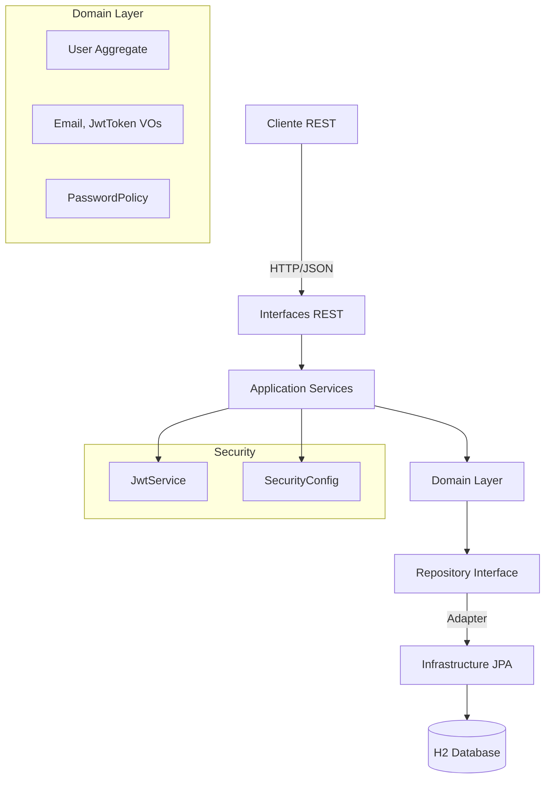

# User Management API

API RESTful de creacion y gestion de usuarios construida con arquitectura DDD (Domain-Driven Design), Spring Boot 3.5.7, Java 17 y H2.

## Arquitectura

Este proyecto implementa una arquitectura DDD en capas:

- **Domain**: Contiene el modelo del negocio (agregados, value objects, servicios de dominio)
- **Application**: Casos de uso y coordinacion de flujos (DTOs, mappers, servicios)
- **Infrastructure**: Implementaciones tecnicas (persistencia JPA, seguridad JWT, configuracion)
- **Interfaces**: Exposicion de la API REST y manejo de errores

## Diagrama de Solucion



## Tecnologias Utilizadas

- Java 17
- Spring Boot 3.5.7
- Spring Data JPA
- Spring Security
- H2 Database (en memoria)
- JWT (jjwt 0.11.5)
- SpringDoc OpenAPI 2.7.0
- Lombok
- JUnit 5, Mockito

## Patrones de Diseño Implementados

1. **Aggregate Root**: User como raiz del agregado que contiene Phone entities
2. **Value Object**: Email y JwtToken como objetos inmutables con validacion
3. **Repository**: Abstraccion del acceso a datos con implementacion JPA
4. **Domain Service**: PasswordPolicy para validaciones de reglas de negocio
5. **Factory Method**: Creacion de agregados con invariantes garantizadas
6. **Mapper**: Traduccion entre DTOs y entidades de dominio
7. **Adapter**: UserRepositoryJpaAdapter implementa el puerto del dominio
8. **Builder**: Para creacion de objetos complejos

## Principios SOLID Aplicados

- **SRP**: Cada clase tiene una unica responsabilidad
- **OCP**: Extensible mediante configuracion (regex, JWT) sin modificar codigo
- **LSP**: Las implementaciones respetan contratos de interfaces
- **ISP**: Interfaces segregadas (UserRepository minimalista)
- **DIP**: Dependencias apuntan a abstracciones, no a implementaciones concretas

## Requisitos

### Desarrollo Local
- Java 17+
- Maven 3.6+

### Despliegue con Docker
- Docker 20.10+
- Docker Compose 2.0+

## Instalacion y Ejecucion

### Opción 1: Despliegue con Docker

#### 1. Clonar el proyecto

```bash
git clone <repository-url>
cd user-management-api
```

#### 2. Crear directorio de logs

```bash
mkdir -p logs
```

#### 3. Construir e iniciar la aplicación

```bash
docker-compose up -d --build
```

#### 4. Comandos útiles de Docker Compose

```bash
# Ver estado de los servicios
docker-compose ps

# Ver logs en tiempo real
docker-compose logs -f user-management-api

# Ver logs de todos los servicios
docker-compose logs -f

# Reiniciar la aplicación
docker-compose restart user-management-api

# Detener todos los servicios
docker-compose down
```

**La aplicación estará disponible en:**
- **API**: `http://localhost:8080`
- **Swagger UI**: `http://localhost:8080/swagger-ui.html`
- **H2 Console**: `http://localhost:8080/h2-console`
- **Health Check**: `http://localhost:8080/actuator/health`
### Opción 2: Ejecución Local (Desarrollo)

#### 1. Clonar el proyecto

```bash
git clone <repository-url>
cd user-management-api
```

#### 2. Compilar el proyecto

```bash
mvn clean install
```

#### 3. Ejecutar la aplicacion

```bash
mvn spring-boot:run
```

La aplicacion se iniciara en: `http://localhost:8080`

## Endpoints Disponibles

### 1. Registrar Usuario

**POST** `/api/v1/users`

Request:
```json
{
  "name": "Juan Rodriguez",
  "email": "juan@rodriguez.org",
  "password": "Password123!",
  "phones": [
    {
      "number": "1234567",
      "citycode": "1",
      "countrycode": "57"
    }
  ]
}
```

Response (201):
```json
{
  "id": "550e8400-e29b-41d4-a716-446655440000",
  "created": "2025-11-11T10:15:30",
  "modified": "2025-11-11T10:15:30",
  "lastLogin": "2025-11-11T10:15:30",
  "token": "eyJhbGciOiJIUzI1NiIsInR5cCI6IkpXVCJ9...",
  "isactive": true,
  "name": "Juan Rodriguez",
  "email": "juan@rodriguez.org",
  "phones": [
    {
      "number": "1234567",
      "citycode": "1",
      "countrycode": "57"
    }
  ]
}
```

**Errores Posibles:**
- **409 Conflict**: 
  - `{"mensaje": "El correo ya se encuentra registrado"}`
- **400 Bad Request**: 
  - `{"mensaje": "Formato de correo inválido"}`
  - `{"mensaje": "Formato de contraseña inválido"}`
  - `{"mensaje": "La contraseña no puede estar vacía"}`
  - `{"mensaje": "El nombre es obligatorio"}`
  - `{"mensaje": "El correo es obligatorio"}`
- **500 Internal Server Error**: 
  - `{"mensaje": "Error interno del servidor"}`

### 2. Login

**POST** `/api/v1/auth/login`

Request:
```json
{
  "email": "juan@rodriguez.org",
  "password": "Password123!"
}
```

Response (200):
```json
{
  "token": "eyJhbGciOiJIUzI1NiIsInR5cCI6IkpXVCJ9...",
  "expiresAt": "2025-11-11T12:15:30"
}
```

**Errores Posibles:**
- **400 Bad Request**: 
  - `{"mensaje": "Formato de correo inválido"}`
  - `{"mensaje": "El correo es obligatorio"}`
  - `{"mensaje": "La contraseña es obligatoria"}`
- **401 Unauthorized**: 
  - `{"mensaje": "Credenciales inválidas"}`
- **500 Internal Server Error**: `{"mensaje": "Error interno del servidor"}`

### 3. Obtener Usuario por ID

**GET** `/api/v1/users/{id}`

Headers:
```
Authorization: Bearer <token>
```

Response (200): Mismo formato que el registro

**Errores Posibles:**
- **401 Unauthorized**: `{"mensaje": "Autenticación requerida. Token JWT inválido o ausente."}`
- **403 Forbidden**: `{"mensaje": "No tienes permisos para acceder a este recurso."}`
- **404 Not Found**: `{"mensaje": "Usuario con ID {id} no encontrado"}`
- **500 Internal Server Error**: `{"mensaje": "Error interno del servidor"}`

## Códigos de Estado HTTP

La API utiliza los siguientes códigos de estado HTTP:

- **200 OK**: Operación exitosa (Login, Get User)
- **201 Created**: Usuario registrado exitosamente
- **400 Bad Request**: Error en los datos enviados (validación, formato)
- **401 Unauthorized**: Token JWT ausente, inválido o expirado
- **403 Forbidden**: Usuario autenticado pero sin permisos suficientes
- **404 Not Found**: Recurso no encontrado (usuario no existe)
- **409 Conflict**: Conflicto con el estado actual (email duplicado)
- **500 Internal Server Error**: Error interno del servidor

## Documentacion de API (Swagger)

Acceder a la documentacion interactiva:

```
http://localhost:8080/swagger-ui.html
```

## Base de Datos H2

Consola H2 habilitada en:

```
http://localhost:8080/h2-console
```

Credenciales:
- JDBC URL: `jdbc:h2:mem:usersdb`
- Usuario: `sa`
- Password: (vacio)

## Configuracion

Archivo `application.yml`:

```yaml
app:
  email-regex: ^[A-Za-z0-9._%+-]+@[A-Za-z0-9.-]+\.[A-Za-z]{2,}$
  password-regex: ^(?=.*[A-Z])(?=.*[a-z])(?=.*\d)(?=.*[@$!%*#?&])[A-Za-z\d@$!%*#?&]{8,}$
  jwt:
    secret: 3cfa76ef14937c1c0ea519f8fc057a80fcd04a7420f8e8bcd0a7567c272e007b
    expiration-minutes: 60
```

### Politica de Contraseña (configurable)

Por defecto requiere:
- Al menos 8 caracteres
- Al menos una mayuscula
- Al menos una minuscula
- Al menos un numero
- Al menos un caracter especial (@$!%*#?&)

### Formato de Email (configurable)

Patron estandar: `usuario@dominio.extension`

## Ejecutar Tests

```bash
mvn test
```

Tests implementados:
- **Domain**: EmailTest, PasswordPolicyTest, UserTest
- **Application**: RegisterUserServiceTest
- **Interfaces**: UserControllerTest
